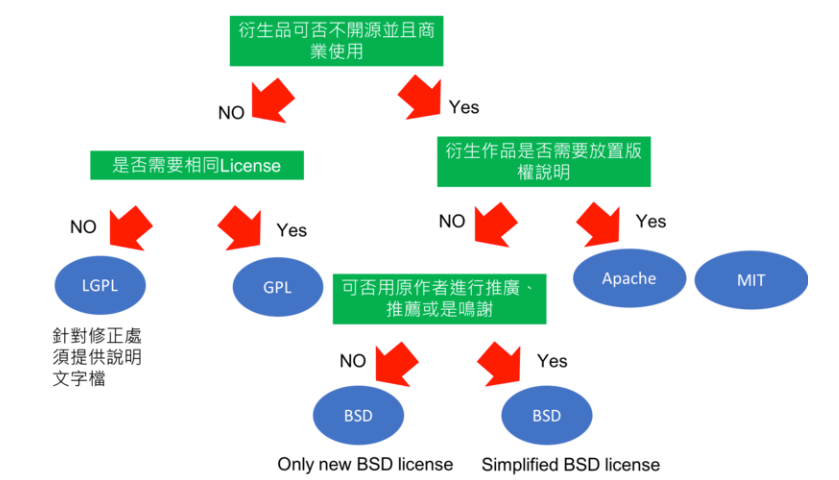

1.Copyright:著作權，不開源   
2.Copyleft：開源，使用者也要開源GPL,LGPL  
3.Copycenter：目前是開源的，之後改不開源也可以BSD  
4.3.0衍生物也要開源  
5.LGPL可以部分不開源 

 

# 必須開源GPL  
## GNU General Public License v2.0  
Linux的授權，不能夠改以 LGPL 的方式後散布  
可以：自由地使用如複製、修改、發布服務  
條件：要求使用者改作後的衍生作品必須要以同等的授權方式釋出以回饋社群以著作權法來創造出創作自由  
## GNU General Public License v3.0
可以：自由地使用如複製、修改、發布服務  
條件：除保障現有的衍生作品外，亦可供使用者選擇是否可一併保障該作品未來版本的"更版"及修正  

# 可以部份不開源LGPL
## GNU Lesser General Public License v2.1
LGPL比GPL更寬鬆，轉變為 GPL 後再行向外散布是可行的  
條件：若參考了 LGPL License 的軟體(包含函式庫)，進行任何改動和/或再次開發並予以發佈  
但是如果僅是針對LGPL的軟體進行任何調用、連接而非包含、修改後再利用，則可以不需開源，所以將LGPL的產品斯考到營利上是部分可行的
## GNU Lesser General Public License v3.0

# 使用BSD必須要遵守的一個規定是，所有以BSD的軟體所衍生出的產品，都必須要包含一段文字以交代原始碼的來源(出處、作者)和其原本的BSD License
# BSD 3-Clause "New" or "Revised" License
條件：衍生作品不可使用原先參考的(BSD)開發者做推薦或是銘謝   
# BSD 2-Clause "Simplified" License  
沒有條件  

# Apache License 2.0
類似 BSD，BSD必須交代其來源程式碼的BSD，而Apache License為需要針對供給你參考的開發者一份 Apache License，若你有修改則需要在修改部分帶有原來的Apache License及相關原作者規定須包含的聲明文件，衍生作品中，亦需要帶有原作品中的協議、商標、專利及其他作者所要求規範的說明文字檔即可

# MIT License
任何衍生品中所參照的開源程式碼，你可以任意地複製、修改、免費使用、營利出售..等，而衍生作品內的MIT License中可更依照程式著作權者的需求更改內容，非屬copyleft的自由軟體授權條款，可允許在自由軟體、開放原始碼軟體或非自由軟體（proprietary software）所使用 
免費下載，自由使用  

# Eclipse Public License 2.0
# GNU Affero General Public License v3.0
# Mozilla Public License 2.0

# 參考資料  
https://progressbar.tw/posts/61  
