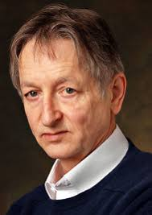
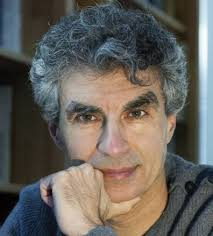
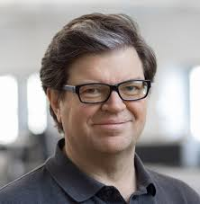

# 人物：
## Adam D'Angelo
事蹟：Quora創辦者之一，前Facebook CTO  
## Alex Smola
稱號：卡內基梅隆教授  
## Anders Hejlsberg
稱號：Turbo Pascal之父(Pascal編譯器)
## Andrew Ng
稱號：AI&ML最有權威學者之一，Coursera創始人之一  
事蹟：創立Google Brain，帶領史丹佛團隊與散播ML知識  
## Carlos Guestrin  
事蹟：亞馬遜教授，Dato(GraphLab)公司CEO  
## Claudia Perlich
稱號：Dstillery首席科學家  
## Demis Hassabis
事蹟：創立Google Deep Mind
## Donald Knuth
事蹟： 發明Tex，<<The Art of Computer Programming>>作者
## Doug Cutting
事蹟：Apache主席，開發出Hadoop,Lucene,Nutch
## Fabrice Bellard
稱號：前圓周率精度計算紀錄保持人  
事蹟：開發出模擬處理器的自由軟體QEMU  
## François Chollet
稱號：Google 深度學習專家
事蹟：發明Keras  
## Gennady Korotkevich
事蹟：2013 美國計算機程式大賽神童,2014 FB 黑客松冠軍
## Geoffrey Hinton
稱號：神經網路之父，深度學習鼻祖，深度學習三巨頭之一，谷歌副總    
事蹟：發明反向傳播，第一個應用BP算法於神經網路與深度學習，2017提出膠囊網路與CNN結合在2018引領潮流
## Guido van Rossum  
稱號：Python 之父  
## Ian Goodfellow
稱號：GAN之父，Google Brain之一  
事蹟：撰寫Deep Learning教科書，一度離開Google到OpenAI又再回去
## Jeff Dean
稱號：Google Brain負責人  
事蹟：創立Google Brain
## John Carmack
稱號:Doom射擊遊戲之父  
事蹟：製作許多膾炙人口遊戲，像雷神之鎚
## Jon Skeet
稱號：Google SW Engineer ,Stack Overflow排名第一  
事蹟：著有<<C# In Depth>>
## Ken Thompson
稱號：Unix之父，參與GO    
事蹟：B,UTF-8
## Linus Torvalds  
稱號：Linux之父,Git之父  
事蹟：太多了
## Petr Mitrechev  
稱號：最有競爭力程序員之一  
事蹟：2000,2012國際奧林匹克信息賽金牌 2006 Google Code Jam,TopCoder勝利,TopCoderPetr演算法比賽第一，Codeforces排名第五，2011,2013  FB黑客松冠軍
## Richard Stallman
稱號：Emacs,GCC之父  
事蹟：發起GNU
## Richard S. Sutton  
稱號：強化學習之父  
## Sanjay Ghemawat
事蹟：前Google架構師  
## Xavier Amatriain
稱號：Quora帶領工程師  
## Yann LeCun
稱號：FB FAIR前院長，FB副總，卷積網路之父，深度學習三巨頭之一  
事蹟：創立FAIR，發明CNN模型，應用於CV,NLP
## Yoshua Bengio
稱號：CIFAR負責人，ApSTAT大牛，深度學習三巨頭之一  
事蹟：創立MILA，第一個結合神經網路與機率模型，推動RNN，研究梯度消失，word2vec雛形

# 學院： 
## 1.MIT計算機科學與人工智慧實驗室(MIT's Computer Science and Artificial Intelligence Laboratory,CSAIL)
1959 AI Lab跟1963 CS Lab 2003年的合併有許多著名成員  
機器人之父-科林·安格爾  
iRobot創始人-海倫·格雷納  
波士頓動力創始人-馬克·雷伯特  
卡內基梅隆機器人學院-馬特·梅森  
致力：人工智慧，尋求理解和發展使人與機器都能便於理解的推理、感知和行為的人工系統；系統  

## 2.卡內基梅隆大學機器人學院（Carnegie Mellon University,CMU,Robotics Academy） 
前身是成立於1979年的機器人研究所，理論與實踐經驗結合  
致力：成為全球研究機器人最好的地方  

## 3.柏克萊人工智能研究室(Berkeley Artificial Intelligence Research,BAIR)
AI子領域與機器人皆有研究  
致力:複製動物行為  

## 4.斯坦福大學的人工智慧實驗室(Stanford Artificial Intelligence Laboratory,SAIL)  
成立於1962年，計算生物學、語音識別和機器學習等，有吳恩達、李飛飛著名研究員  
致力:推動機器人教育  

## 5.伊利諾伊大學厄本那香檳分校(University of Illinoisat Urbana-Champaign,UIUC)  
高速計算世界領先   

# 企業  
## 1.Google DeepMind Lab：Google 收購開發AlphaGo的DeepMind  
不斷研發多功能的、能夠像人類那樣廣泛和高效思考的“通用型”人工智慧  
致力：攻剋智能領域的難題，結合神經科學與ML前沿技術  

## 2.Google Brain Lab：Google自己的AI Lab  

## 3.Microsoft Research AI研究院  
十三個研究小組：  
自適應系統和互動組、空中信息和機器人組、會話系統組、深度學習組、信息和數據科學組  
知識技術組、語言和信息技術組、機器學習和優化組、機器教學組、自然語言處理組  
感知和互動組、生產力組、強化學習組

## 4.Facebook’s Artificial Intelligence Research,FAIR  
紐約大學教授Yann LeCun 領導,開放研究推動ML發展  
致力：理解智能本質  

## 5.Facebook's Applied Machine Learning,AML  
機器學習領域專家Joaquin Candela領導  
致力：基礎科學和長期項目的研究，以及找到將人工智慧和機器學習領域的研究成果應用到Facebook 現有產品的方法  

## 6.Montreal Institute for Learning Algorithms,MILA  
蒙特利爾，新矽谷，Yoshua Bengio領導    

# 深度學習三巨頭，2018圖靈獎得主    
## Geoffrey Hinton(主要貢獻：反向傳播，波爾茲曼機，第一次用RELU改善CV)  
  
## Yoshua Bengio(主要貢獻：序列機率建模，高維詞嵌入與注意力機制發展NLP，與Ian Goodfellow提出GAN)  
  
## Yann LeCun(主要貢獻：提出卷積神經網路發展CV，改進反向傳播)  
  

資歷：Hinton > Lecun > Bengio  
嚴謹度：Lecun >= Bengio > Hinton

# 各領域大大 
https://mp.weixin.qq.com/s/WMbqWklfgyCKqc9whMPRyQ  
http://bangqu.com/s99z44.html  

# 參考資料：  
https://mp.weixin.qq.com/s/Ie7LEabH_sU0RGCVViU-gA  
https://mp.weixin.qq.com/s/av4ZIITZH_KMBiHAAAIh0A  
https://mp.weixin.qq.com/s/tOH04d2d41VPgf9NcphPLA  
https://mp.weixin.qq.com/s/wfWGIz0tQO-YUQ3kdby9DA  
https://mp.weixin.qq.com/s/lmA_VZwmYHtFM2Ur5TjNfQ  
https://mp.weixin.qq.com/s/e31OL7fiBRJoAT-Tz8q4PQ  
https://mp.weixin.qq.com/s/7vuJuguXWEM33A4qcERtNA  
https://mp.weixin.qq.com/s/59Dks3G_8h3DuMeuexO35A  
