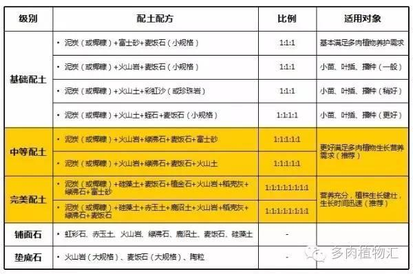

 http://www.tsherb.com.tw/indexDetail.php?ed_id=1  
http://www.bonsai-net.com/class.html   
https://www.peekme.cc/post/700205  

# 心得
1. 催芽：種子要先放衛生紙噴水，在溫暖陽光下發芽再土植，比較難出芽的植株可以先放溫水一晚再放衛生紙(溫湯浸種)，幼苗先用緩效肥促進生長    
2. 間拔：去弱留強，選莖粗的苗   
3. 生根：香草類植株剪莖放水裡生根再土植，發根前植株要蓋著保濕  
3.1. 壓條：把靠近土面的枝條壓入土中固定，等長根後再剪下來    
3.2. 高壓條：枝條位置太高或太硬，無法直接壓入土中，就把土搬到枝條上包覆，是草本，通常直接包覆就好；如果是木本，通常會先做環狀剝皮促進發根  
4. 澆水：『土乾再澆、每澆必濕』，『澆水要暴飲暴食、施肥要少量多餐』  
> 太乾  
> 準備一個比花盆大的容器  
> 放入花盆後緩緩加水，讓水由下往上滲入  
> 如果花盆因為介質太乾太輕而浮起，先暫停等它吸水下沉，不要讓它「翻船」  
> 加水到接近盆緣，但不要超過  
> 等到盆內界值表面開始出現水滲出且全濕時即可將花盆拿出滴乾，通常 30 ~ 60分鐘即可回魂   
>如果回不來或要很常補水，枯掉的可以做堆肥  
5. 摘葉：要留幾片行光合作用  
6. 種植：深不埋心 淺不漏根  
6.1. 生長期: 氮肥  
6.2. 開花前期: 高磷肥催花  
6.3. 結果期: 高磷鉀肥幫助果實發育  
7. 土耕轉水耕：採收時留下粗壯健康莖，剪頂端大概一個手指長的莖，拔除底葉水插生根移到土裡  
8. 水耕轉土耕：匍匐莖移除葉子壓條加蓋，避免太陽直曬，生根剪除連接部份莖，移到大容器，再施點肥  
9. 植物不怕水，但怕悶濕  
10.舊土曝曬混熟成堆肥  

# 可以種
## 無花果  
## 秋葵  

# 有存活
## 薄荷
季節:春末 初秋分株  
光: 半日照   
水: 土不可乾透,夏要比較多水避免枯黃,秋冬少水      
土: 底部碎石排水  
肥: 氮,不太需肥，2個月一次  
栽培: 春秋換盆,將薄荷的枝葉從頂端剪約5-10cm  
儘量找剛發芽而枝葉是嫩綠色的，去除底部葉片  
插水生根再植土    

## 鳳梨頭
肉跟底下幾片葉子拔掉會看到生根點，放水中生根再土培    

## 酪梨  
季節:  春季3～4月和秋季11月為栽植適期。一般以5至7公尺為宜。   
光: 全日照    
水:  12月份需保持較乾燥以促進開花外，其他時間以保持土壤水份適中為原則     
土:  黏土、砂土或石礫土皆可生長良好  
肥:   氮肥及鉀肥須宜至少分四次使用。氮與鉀肥之施用時間為1月、6月、10月份，磷肥則在6月份一次全施  
栽培:   每一新梢長出時留1-5公分摘心，以促進側枝之生長  
開花習性分成兩群。第一群 (甲群)酪梨花在上午第一次  
開放，大約於中午後閉合，而於第二天下午再開放。第二群 (乙群)  
的則在下午第一次開花，後大約於傍晚關閉，而於第二天上午再開放  
不同開花習性之品種配合種植才可結果  

## 芡歐鼠尾草(奇亞籽)
季節:  春秋   
光: 半或全日照      
水:  皆可        
土:  黏土、砂土或石礫土皆可生長良好  
肥:   皆可  
栽培:   皆可   
生態殺手  

# 沒存活
## 迷迭香-日照不夠，太悶濕
季節:春末 初秋分株,避免高溫多濕的氣候及環境    
光:  保持全日照,乾爽    
水:  土很乾再灑一點水     
土:  微酸ph6-7, 防止土散     
肥:  不需要肥料  
栽培: 植株要能通風、保持涼爽,空氣流通,要剪掉過多和老化的枯枝葉，並撿拾落在盆土表面的枯枝葉  

## 香蜂草-季節不對
季節:春末 初秋 怕熱  
光: 半日照 可跟薄荷一起  
水: 夏要比較多水避免枯黃,秋冬少水,別澆葉子      
土: 略濕,微酸ph6-7   
肥: 氮,不太需肥，2個月一次 
栽培: 可以杆插  

## 虎尾蘭-根系太密，沒換盆
``耐陰植物 ``  
後來知道他可以剪掉葉片爛掉處生根  
https://github.com/eric999j/Clutter/blob/master/5.2.3.%E7%94%9F%E6%B4%BB-%E5%81%A5%E5%BA%B7%E7%9A%84%E7%A9%BA%E6%B0%A3.md  

## 番茄-太乾  
季節: 避開夏天及雨水比較多的季節   
光: 溫暖乾燥， 氣溫低於15度或高於32度是不宜種植的，果實溫度18~26度最適合  
水: 不澆低溫水，陰天不澆水，傍晚不澆水，不大水漫灌  
土: 要求比較濕潤而且疏鬆的土壤  
肥:  需要大量的肥料  
栽培:   
缺鈣:末端枯黑,土石灰    
缺硼:環狀龜裂,水硼  
要溫湯浸種催芽

## 西印度櫻桃-太溼   
季節: 一年有兩次的花期，分別在5,6月以及10,12月。 一年兩次結果期，分別在3,4月以及7,8月  
光:   全日照
水: 澆至盆底透水        
土: 沙質土， PH值6.5-7.5的土壤較為適宜   
肥:  以有機質肥料及化學肥料並重    
栽培: 
西印度櫻桃採收後，將果皮果肉搾破取出果核，並以清水洗除附著果核外之果  
肉，而後將之放在陰涼處晾乾 1～2 日即可播種。播種時將果核直接播在淺盆或  
72 格穴盤中，播後約 10～30 天發芽，高溫期發芽較快，低溫期發芽甚慢。待幼  
苗長至 5～10 公分時，再將之移植於塑膠軟盆中。  
剛開花時就要先用毛筆授粉，再噴著果劑(劑量1:100不可多及少，不然沒用)，對花噴(霧狀)有噴到有濕就好~噴多了一樣會落花  

## 燈籠果-怕肥，老葉掉，新葉皺
季節: 春秋  
光: 白天20-28度 ，  夜間14-17度  
水: 夏季的時候3-5天就可以澆一次水，正常情況下每5-7天就要澆一次水        
土: 沙質土， PH值6.5-7.5的土壤較為適宜   
肥:  果實膨大之後，就要追加第2次肥料  
栽培:   
在壯苗的期間，一般會對燈籠果進行兩次間苗操作，在燈籠果第一片真葉露心時，就會進行第一次間苗，此時會留2-3株壯苗。而當燈籠果出現2-3片真葉時，就會進行二次間苗，只留一株壯苗

# 未來  
有些東西盆栽種不起來，哪天有院子再說  

## 紫蘇
## 三寶柑 
## 黃金果
## 餘甘子
## 野薑花
## 月桃
## 樹葡萄 
## 仙桃
## 羅李亮果　　
## 四季金桔
## 木鱉果  

# 香草
大部分植物都能接受的土壤是—排水良好的沙質壤土 。如果是盆栽，則以泥碳苔為主成分的培養土(泥碳土)，再自行調配1╱4的河沙  
草本植物在每次修剪後就要施肥   
用手直接去觸摸土壤，還濕濕的，就不要澆水，有一點乾才澆水。澆水就要一次澆到溼透為止  
有些植物很不耐積水，如：薰衣草、迷迭香，在澆水後要把多餘的水滴乾  
大部份的香草植物都要全日照栽培  

# 介質

## 排水層  
* 陶粒: 大顆粒、質地輕、多孔、透氣性好、穩定  
* 缽底石: 質地輕、透氣、保水  
* 碎竹炭: 質地堅硬、通氣性好、具有良好的吸附能力，抑制細菌  
* 綠沸石：用綠沸配土最大的作用在於防止植株根腐爛，有效抑制土壤中有害物質繁殖，提高肉肉抗病抗旱抗逆能力。同時具有吸附緩釋分子能力，緩釋養分，防止燒苗，通氣性好，可長期保持疏鬆，具有貯存和提供氧氮的功能  
* 粗椰纖: 可以避免介質流失又能保持良好排水

## 中層
## 土
* 泥炭土：又稱黑土、草炭，是古代低溫、濕地的植物遺體，被埋在地下，經數千萬年的堆積，在氣溫較低、雨水較少或缺少空氣的條件下，植物殘體緩慢分解而形成的特殊有機物，多呈棕黃色或淺褐色。也是一種多肉配土的最佳介質。 盆栽常用，管理時最好在介質未完全乾燥之前即應澆水，  久了會軟腐黏膩而降低透氣性與排水性，如果還是密集澆水就很容易造成過度潮濕的爛根現象  
* 火山土：火山土是由火山噴發後的灰燼凝固而成，蘊含多種微量元素和礦物質，這些成分讓火山泥的物理特性十分穩定，並且廣泛應用於各種領域，因其獨具的高通透性與保水性更是廣泛用於多肉植物的栽培基質  
* 硅藻土：硅藻土是一種優良的基質成分,其吸水、保水性能強，栽培花卉的生理指標和形態指標更優,不易爛根。是作為多肉植物、景天、生石花等鋪面土，十二卷等混合顆粒緩釋肥直接使用，也可以與泥炭土等混合使用  
* 赤玉土：由火山灰堆積而成，是運用最廣泛的一種土壤介質。這也是在日本運用最廣泛的一種栽培介質。它是高通透性的火山泥，暗紅色圓狀顆粒，沒有有害細菌，PH值呈微酸。 含有一定磷鉀肥，PH呈微酸性，高通透性，蓄水排水能力佳，無蟲卵細菌 
* 鹿沼土：一種罕見的物質，產於鹿沼地區的火山區，是由下層火山土生成，呈火山沙的形式，PH值呈酸性，有很高的通透性、蓄水力和通氣性。產於火山區，是由下層火山土生成，呈火山沙的形式。PH值呈酸性，有很高的通透性、蓄水力和通氣性。尤其適合嫌氣、忌濕、耐瘠薄的植物，如各類盆景、蘭花、高山花卉  

## 填充
* 白火山岩：又稱火山石，具有保水和透氣的特性，同時質地較硬，比赤玉土還硬，富含矽、鋁鐵、鉀、鈉、鈣、鎂、錳、磷等常量元素以及其它多種微量元素，適合用來種植多肉、國蘭等這類對透氣性要求較高的植物  
* 黑火山岩：又稱黑金砂，富士砂，是火山爆發後形成的多孔形石材。具有質地硬朗，良好的通氣排水性能，含多種火山有益元素，在種植上可用於植物混料、鋪面、墊底等方面。適合於仙肉、盆景、蘭花種植等品種  
* 椰糠：椰糠是椰子外殼纖維粉末，是加工後的椰子副產物或廢棄物。是從椰子外殼纖維加工過程中脫落下的一種純天然的有機質介質。經加工處理後的椰糠非常適合於培植植物。一、天然、純有機；二、對環境不會造成污染；三、保水性強；四、透氣性佳；五、植物成長最佳的有機介質， 純椰纖排水透氣很好，但夏季可能因此乾的太快，混合泥炭可調整平衡 
* 稻殼灰：稻殼灰又稱薰炭，是以稻殼為原料經薰制而成。質量輕，透氣性、保肥性好，吸附性強。PH值呈鹼性，含有植物所需的磷、鉀、鎂等元素。同時稻殼灰有很多的細孔，為微生物提供了良好的生存環境，很好地促進了土壤微生物的活化。含有一定的鉀肥，鹼性比較高，不適用於種植喜酸性土壤的花卉（例如茉莉、梔子），但喜歡偏鹼性土壤的植物就非常適合（例如鐵線蓮）  
* 珍珠岩：一種火山噴發的酸性熔岩，經急劇冷卻而成的玻璃質岩石，因其具有珍珠裂隙結構而得名。珍珠岩的本身性質穩定，持水保肥能力強，可用來做盆栽混合物和土壤改良與泥炭土依體積以1：1混合，是良好蘭花栽培介質，  但時間久了很容易崩解而失去功能（用手一捏就碎），  白火山岩比較好    
* 蛭 石：蛭石主要作用是增加土壤（介質）的通氣性和保水性。因其易碎，隨著使用時間的延長，容易使介質緻密而失去通氣性和保水性，所以粗的蛭石比細的使用時間長，且效果好。質地輕、保水透氣性好，蛭石效果不若珍珠石  
* 彩虹沙：彩虹沙有很好的透氣性，使用彩虹沙配土可以增強土壤的防澇能力，特別適用於大多數喜歡澆水的手賤黨。使用彩虹沙配土的土壤具有較好的持水力不易分解，變碎，不滋生蚊蟲，保肥能力強等特點  
* 粗河沙: 常與泥炭土、園林土等混合使用改善土塘結構，增大孔隙度，但久了容易板結    
* 鍛燒粘土: 適用於栽培期較長的盆栽介質  
* 植金石：植金石也是一種火山石，是火山爆發之後，釋放大量氣體、熱量，經特殊溫度而形成的多孔、體輕、能迅速吸取養分、保持水分的石頭，再經過高科技技術加工而成。因而其具備體輕、排水、保濕、透氣性俱佳的特性。不論單獨使用，或與其他基質混合使用，均可發揮極佳效果  
* 虹彩石：也稱彩虹石，是一種配方型介質，各個廠家生產的配方略有不同。一般來說，基本都包含：輕石、沸石、熔岩石、控釋肥等。在植物栽培過程中通常用作底石及鋪面使用  

## 蘭
* 薇根: 含有2～3%的氮，可慢慢分解釋出  
* 蛇木: 排水迅速、通氣性高而保水性低  
* 樹皮: 分解時有大量的微生物參與，故氮肥的施用量要較多  
* 水苔: 吸水性、保水性特佳  
* 岩棉: 歐美盛行用岩棉做養液栽培種植番茄、小黃瓜、甜椒、玫瑰、非洲菊、東亞蘭及蝴蝶蘭等。台灣則應用於蝴蝶蘭及蕙蘭類  

## 流程
1. 粗椰纖鋪底  
 2. 舖底層土  
 3. 舖底肥  
 4. 舖滿土  
 5. 以原盆為模具做出植穴並敲緊土  
 6. 放入苗（注意方向性）  
 7. 澆「定根水」  
 8. 再補滿土  

## 配土
適合多數植物：泥炭土+珍珠岩+赤玉土+稻殼灰\碎竹炭  
適合播種育苗：泥炭土+稻殼灰+粗河沙  
適合扦插育苗：泥炭土+蛭石  
多肉植物配土比例：泥炭土+椰糠+珍珠岩+粗河沙  

  

## 鋪面
松鱗: 質地輕、透氣、保水排水性能好、微酸性  
麥飯石：麥飯石是一種天然的矽酸鹽礦物，學名：石英二長岩。麥飯石對生物無毒、無害並具有一定生物活性的複合礦物或藥用岩石。 麥飯石的主要化學成分是無機的矽鋁酸鹽。其中包括SiO2、Al2O3、Fe2O3、FeO、MgO、CaO、K2O、Na2O、TiO2、P2O5、MnO等，還含有動物所需的全部常量元素，如：K、Na、Ca、Mg、Cu、Mo等微量元素和稀土元素。麥飯石能夠穩定和提高、平衡土壤的物理機能，所以它比其它土壤改良劑更有優勢。正因為這樣，麥飯石成為廣大多肉植物愛好者的必備的配土介質。
細白石:   
粗河砂:   

# 肥料
農委會所發表的資料說明，有機肥中的碳氮比最佳值在15:1-20:1之間，可以提供土壤中益菌與植物生長的共同需要  
好氧性堆肥化所需時間約一個月，而厭氣性發酵法需四個月以上   
味道變臭時可以加入碳元素，像是報紙，瓦楞紙，葉子之類的；不過如果堆肥一直沒有發酵，可以加入有點氮的東西  
保持適當水分寧願少一點, 也不要過多。一般生垃圾含水率通常在 40-65% 範圍內，若作好氣性堆肥時以50-60% 含水率為最佳   
半熟肥：一般指堆肥材料明顯或稍微還看得出原本的樣子；其肥份新鮮有效，對土壤改良效果佳  
完熟肥：則是堆肥材料多數已經粉碎並轉為黑褐色手感膨鬆，不結塊，聞起來有泥土的香氣，沒有惡臭或阿摩尼亞的味道。以石蕊試紙測試時，酸鹼值<PH值>趨於中性。其肥份較差但較穩定，對土壤改良效果有限  
一點點霉臭味，表示腐熟狀況好，強烈的氨刺鼻味，則表示腐熟不夠完全  
腐熟堆肥會沈入水中  
化學肥料之過度使用的結果，土壤中有益微生物死亡，農地呈現劣化、硬化、酸化現象，缺乏有機質及各種礦物元素，而使劣地生產力與產品品質降低，必須補充有機質肥料加以改良，以增進地力，提高作物品質   
氮肥適合在枝葉即將長出時使用  
堆肥應該無惡臭，稀釋1000-3000倍  
奧斯魔肥有微量元素，比好康多好  
底肥要看植物生長的階段下  

# 營養
幼年期或正值成長發育階段，最需要高氮肥，能使它長大的營養，例如：花寶二號、花寶五號  
開花結果期要施用含磷鉀肥較高的肥料，以使花美果大，例如花寶三號、漁人魚精開花肥  
花謝果熟後，也要像人類產後補身一般，補充適當的肥料，應迅速施花寶二號  
氮肥有助於莖葉的營養生長，磷肥則有助於花芽的生殖生長，而氮肥與磷肥的吸收上是會互相衝突的（兩者都是陰離子），氮肥太高會抑制磷肥的吸收而不利於花芽分化，此時就得提高磷肥而抑制氮肥吸收，也就是「壓氮」，如果有使用菌肥，則可利用提高碳值供應讓微生物來消耗過多的氮肥，也就是「沖氮」  
促進「營養生長」轉化為「生殖生長」的另一個方法就是製造危機(斷水（讓植物盡量乾到萎軟缺水再澆）、製造傷害（如修剪、製造枝幹損傷等），傳說中的木瓜釘釘子會變性、玉蘭花不開花就是欠打等等，都是藉由製造危機意識促使植物轉化為「生殖生長」  

## 三要素(氮葉 磷根花果 鉀根莖花果) 
### 葉肥的氮(N):葉肥大，顏色翠綠，生長速度快

構成胺基酸與葉綠素不可或缺的成分，而胺基酸又是構成一切生物細胞主要成分 - 蛋白質的原料，缺乏氮植株矮小，細弱；葉呈黃綠、黃橙等非正常綠色，基部葉片逐漸乾燥枯萎，過酸的土壤會造成氮肥吸收不良、也容易造成微量元素過度吸收而重金屬中毒、還會導致根部發展不良  
* 堆肥：霉掉的豆類、花生米、瓜子、揀剩下來的菜葉、豆殼、瓜果皮或過期變質的奶粉等敲碎煮爛，放在小罈子里加滿水，再密封起來發酵腐熟。為讓其儘快腐熟，可放置在太陽照射處，增加溫度。當壇內的這些物質全部下沉，水發黑、無臭味時（約需3-6個月），說明已發酵腐熟。在夏季，10天後即可取出上層肥水使用  
* 用法：加水稀釋後葉面追肥,沉在底下的渣子可以繼續泡,也可拌在土裡或墊在盆底作基肥  

### 花果肥的磷(P):苗期開根、成年開花、後期結果  
是細胞遺傳物質主要成分 - 『核醣』不可或缺的重要成分，也是細胞能量運作的關鍵成分，對植物開花結果有重大的影響，  不足樹木生長緩慢，葉小、分枝或分櫱減少，花果小，成熟晚，下部葉片的葉脈間先黃化而後呈現紫紅色。缺磷時通常老葉先出現病症，過高的磷肥比也會抑制氮肥的吸收，於是植株生長就開始出現新葉脫肥與反捲的特殊現象 
* 堆肥：魚刺、骨頭、雞蛋皮、淡水魚的魚鱗，倒入缸內並加入適量金寶貝發酵劑（厭氧型）後加入少量水，密封，經過一段時間的腐爛發酵便可摻水使用  
* 用法：發酵的產物兌水後使用；碾碎的骨粉等可做基肥使用  

### 硼
花粉萌芽的重要關鍵，缺硼會造成花粉活性不足而容易受粉失敗  

### 根肥的鉀(K):儲蓄養份長胖，果實大又甜，根、莖、葉、花、果實的大小
光合作用、呼吸作用，影響酵素的活化、氣孔開合，是植物體內包含醣類合成等數十種代謝的活化劑、也是根與莖葉間營養輸送的重要關鍵，對根莖生長與果實甜度有關鍵影響，鉀會引起葉片收縮、發黃或出現棕褐色斑點等症狀  
缺鉀：鉀肥會促進光合作用能量的轉化與儲存，累積的養分能促進果實生長，如果鉀肥不足就容易使果實偏小、或甚至因營養不良而流產  
* 堆肥：殘茶水、淘米水泔水和草木灰水，洗牛奶瓶子水等都是上好的鉀肥，可直接用來種菜澆花。都是含有一定的氮、磷、鉀等營養成分，用來澆灌菜、花，既能保持土質水，又能給植物增添養分，能促使根系發達，有效提高植物抗病能力  
* 用法：充分腐熟  

## 次量要素
鈣：細胞壁，補筋骨讓植物細胞強硬（所以能減少病蟲害  
鎂：葉綠素關鍵成分， 鎂可以資源回收，所以會出現老葉的葉綠素被分解供應新葉使用，所以是老葉花葉而新葉正常，也能加強磷肥效果     
硫：蛋白質  
## 微量元素  
鐵：製造葉綠素過程的重要成分、傳遞酵素，無法資源回收，所以直接出現新葉花葉、老葉則正常，大多數的缺鐵都是由於酸度問題所引發，鐵和鋅都是金屬元素，必須在酸性環境才會溶解而被植物吸收    
錳：光合作用  
鋅：酵素系統、氮素代謝，生長的新陳代謝、蛋白質合成等生理作用有關，缺鋅就會造成新芽發育受阻而有簇葉現象，在草莓的典型症狀就是葉片變的小而狹長    
鉬：固氮酵素及硝酸還原酵素  
銅：葉綠素、同化作用、呼吸作用  
硼：分生組織生長及醣類運轉與代謝  
氯：促進光合作用、調節氣孔張合  

## 種植
底層鋪1cm椰纖，再加底肥，隔離土，放植株，放土後盆敲地面再下定根水  
定根水木黴菌發酵液 蕈狀菌發酵液個半  

# 自然農藥  
生石灰、 硫磺粉、水以1：2：10 的比例，先將1 份生 石灰加10 份的水加熱後，再加入2 份的硫磺 繼續煮1 小時即成。 防治細蟎時，視發生情況 以水稀釋200∼500 倍噴施  

# 如何用藥如何治療？
《蘇力菌》防治蝶蛾類蟲害  
《苦練乳》在最佳的油、水、界面活性劑比例下，同時具備有展著劑功能   
《二氧化氯》殺菌，用稀釋20倍泡根5分鐘殺菌  
《枯草桿菌》防治葉面病害  
《矽藻土》等各種莖葉表面的抗病防蟲防治資材時  

## 蘇力菌
讓幼蟲無法進食  
夜盜蟲  
小菜蛾（吊絲蟲）  
夜蛾類  
黑肚蟲  
## 苦楝粕
雞母蟲  
馬陸
所有地底蟲卵  
## 苦茶粕
蝸牛  
蛞蝓  
蚯蚓  
所有地底軟殼類       
## 綠佑精+蔬果清
蚜蟲 ，芥殼蟲，粉芥殼蟲，銀葉粉蝨，蓟馬，蟎類  
可除芽蟲，芥殼蟲，粉芥殼蟲，銀葉粉蝨  
綠佑精或（葵克立）+蔬果清+蘇力菌  混搭使用  
綠佑精抑制幼蟲褪殼蟲卵孵化  
蔬果清由多種植物精油混合而成  
蟲蟲對它有忌避作用  
## 綠佑精+蘇力菌
鳞翅目，黑肚蟲，青蟲，切根蟲，根瘤線蟲，雞母蟲…等  
綠佑精或（葵克立）可擇一+ 蔬果清+蘇力菌  

# 有機除蟲劑濃度使用
## 1
水  1500cc  
綠佑精 3cc  
蔬果清 3cc  
## 2
水  1000cc  
綠佑精  2cc  
蔬果清  2cc  
## 3
水   500cc  
綠佑精  1cc  
蔬果清  1cc  

# 器材  
1. 挖洞補土器：前端深湯匙,後端圓筷的不繡鋼  
2. 澆灑水壺：花灑頭上來連接另一端按壓開口  

# 注意
3合1混搭一起噴，不要早上噴，下午噴  
一星期噴一次  
嚴重時3天噴1次  
9天當中噴3次  
刮大風，下大雨時，不要噴. 
之後輪轉再1星期噴1次為保養  
外加保綠贊可抑制白粉病，露菌病，黑黴病…等  
保綠贊可使植物體質強壯  
木黴菌可在土壤發揮滅菌效果  
噴在枝幹葉片也可殺菌  
能強化植物本體及達到滅菌效果. 
綠佑精或（葵花乳劑）可擇一  
蔬果清+蘇力菌+ 保綠贊+木黴菌可以混搭使用，可除病害又可強健  
傍晚噴不要皁上噴  
刮大風下大雨不要噴  
一星期噴一次  
嚴重蟲害時  
每３天噴1次  
9天當中噴３次   
冬季氣溫低，植物生長緩慢，大多數處於生長停滯狀態，一般不施肥;春、秋季正值生長旺期，根、莖、葉增長，花芽分化，幼果膨脹，均需要較多肥料，應適當多些追肥；夏季氣溫高，水分蒸發快，又是生長旺期，施追肥濃度宜小，次數可多些  

# 小耕園建議
1. 首先就是不能用菇蕈太空包回收木屑製成的廉價培養土，因為在製作過程會家禽畜糞尿露天發酵，除非有殺菌否則幾乎都帶有病原  
2. 發酵不完全的有機肥也可能帶菌、還欲過水受汙染的情況，而薰衣草抗性特別差，所以從店家買回來的盆栽最好先經過處理  
【預防性與治療性的處理方式】  
a. 先以二氧化氯稀釋澆灌並噴濕全株消毒，每天一次，連續2~3次  
b. 消毒完成後，以《木黴菌》＋《蕈狀芽孢桿菌》稀釋澆灌，建立健康菌相避免再度感染  

# 名詞
EC值（土壤電導率）：土壤水溶性鹽的指標，而土壤水溶性鹽是表層土壤中可被植物迅速利用的礦質營養的一個重要指標，是判定土壤中鹽類離子是否限制作物生長的因素  

# 參考資料
http://www.taihort.com.tw/2nutritn.html  
https://kmweb.coa.gov.tw/knowledge_view.php?id=1136  
https://m.xuite.net/blog/star297/starmoon/41535851  
https://www.facebook.com/LaNOVA.Design.Product/    
https://kknews.cc/agriculture/b82jj.amp  
https://ayeah3713883.pixnet.net/blog/post/458967685-多肉植物的施肥  
