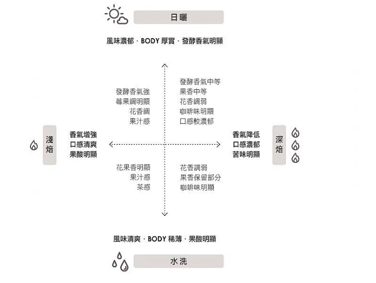
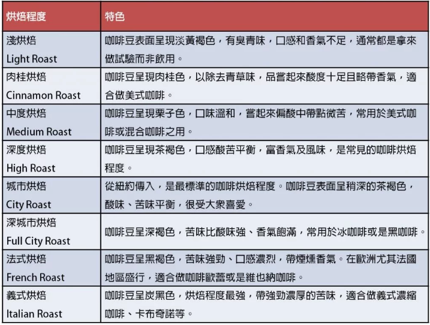

# 生豆品種  
1.Arabica(貴，味道柔順，咖啡因低，綠原酸(chlorogenic acid,單寧酸,苦澀味)低    
中線s型，產量大，一般飲用  
產地：巴西，哥倫比亞  
淺培：花果香  
深培：酸將苦升  
2.Robusta(中價位    
即溶咖啡  
淺培：麥香，穀物，苦不酸  
深培：油脂，苦味加深  
3.Liberica(便宜，苦，咖啡因高，綠原酸高    
中線I型，產量小  
產地：越南，非洲，印度  

# 產地  
巴西：巧克力味  
哥倫比亞：果香，味淡  
印尼：泥土煙燻味  
衣索比亞：耶加雪菲，糖漿莓果味，        
肯亞：蕃茄味  
夏威夷：甜香  
蘇門答臘：曼特寧，糖漿巧克力味，不酸    
牙買加：藍山，不苦微甜  
古巴水晶山：與藍山相鄰，柔和，不酸  
埃塞俄比亞：摩卡，酸，刺激  
巴拿馬：瑰夏，豐富水果香氣  

# 生豆處理
1.雨量少：日曬法（較優    
果皮肉一起曬，不去果膠  
風味：濃郁    
果酸：弱  
香氣：醬香  

2.雨量多：水洗法  
無皮肉，水漕浸泡，微生物發酵  
風味：清爽    
果酸：強  
香氣：清香  

3.蜜處理法(半日曬法  
去皮，果肉果膠一起乾燥     
風味：較濃    
果酸：弱  
香氣：水果香  

# 烘培  
烘培程度與養豆時間(天)：  
* 極淺 light roast：14，青草味，香氣不足    
* 淺 cinnamon roast：10，一爆，酸，花果香，酸度高，美式咖啡，爆完隔幾天再磨   
* 中 medium roast：7，略苦帶青草味花果香，香氣適中，美式咖啡   
* 中深 high roast：4-5，未進二爆，酸苦均衡帶甜，堅果蜂蜜味  
* 深度烘培是二爆，苦，咖啡味
*  城市烘焙 city roast：酸度降低，大眾口味  
*  深焙/全都市烘焙 full city roast：苦味強，奶油巧克力味  
*  法式烘焙 french roast：苦味濃，煙燻香  
*  重焙/義式烘焙 italian roast：更苦，菸草，刺激味  
養豆：48小時左右會持續吐放二氧化氮(排氣)  
4天風味達顛峰  
最長2周飲用期  
  
 

# 保存  
1.密封  
2.避免光照  
3.長勺拿取：  新鮮咖啡豆所釋放出的二氧化碳會存留在容器的底部，形成抗氧化層  
4.乾燥通風，勿放冰箱  
良好保存：生豆3年老豆10年  
一般保存：半年至一年  

# 研磨  
粗研磨（Coarse）：顆粒如粗鹽大小，適合法壓式、過濾式咖啡  
中研磨（Medium）：顆粒如砂礫狀，適合平底濾壺的滴濾式咖啡  
細研磨（Fine）：顆粒如一般的糖或鹽，適合錐狀濾壺的滴濾式咖啡  
濃縮咖啡式研磨（Finer/Espresso）：顆粒比一般糖再更細一些，適合濃縮咖啡  
極細研磨（Finest/Turkish）：顆粒如烘焙用細糖，適合土耳其式咖啡  
一般建議：  
粗：細=淡：苦，差不多像二砂  

# 淬取  
咖啡淬取方法：  
浸泡：咖啡渣泡熱水或冷水，咖啡粉完整浸泡數小時，一般約為6～24小時，以濾紙或濾布濾掉咖啡渣    
滲透：摩卡壺，下壺加熱水滲透咖啡粉  
滴濾：手沖或冰滴  
烹煮：水跟咖啡一起煮，多用在美式咖啡  
加壓：高溫高壓粹取，expresso就是這樣  
真空：用虹吸原理，在下壺有熱源時帶水到上壺  

Expresso淬取方式：  
9大氣壓，25…30c.c.,20…30秒，水溫85…92度  
義式咖啡：  
Crema：義式濃縮上的一層油  
黃金粹取：18-20克咖啡粉,22-27秒,產生60克濃縮咖啡  
過淬：水溫過高或時間過長導致酸苦  
預先浸泡咖啡粉：幫助粹取更順口  

# 手沖  
水溫85-92度(酸-苦)  
咖啡粉：水=1:10，如果冷淬0.6,0.7:10  
中心向外沖，平穩緩慢注水  

# 何時喝  
9:30-11:30 am  
1:30-5:30 pm  

# 其他資訊  
拿鐵(牛奶)：1/6濃縮咖啡，奶泡，剩下4/6蒸氣牛奶  
卡布奇諾(咖啡)：都1/3  
摩卡(可可)：2/5濃縮咖啡 1/5蒸氣牛奶 2/5可可,也可加點茴香酒  

# 咖啡有益健康  
http://bit.ly/2W8cMhQ  
1.每天喝3杯黑咖啡  
2.選擇淺烘焙咖啡豆，保留最多抗氧化物  
3.早上9-10點、下午3-4點，喝咖啡CP值最高。  
4.一杯咖啡搭配一杯開水，補充身體水分。  
5.喝咖啡1小時後喝牛奶，補充鈣質。  
6.無論哪種咖啡，最重要是注意保存期限。  
7.胃有宿疾，飯後再喝咖啡。  

# 參考資料  
https://blog.icook.tw/tags/761  
https://blog.icook.tw/tags/11701  
https://blog.icook.tw/posts/125258  
https://blog.icook.tw/posts/82704  
https://blog.icook.tw/posts/125179  
https://blog.icook.tw/posts/103857  
http://lovelifego0221.pixnet.net/blog/post/334303940-%E5%92%96%E5%95%A1%E5%9F%BA%E6%9C%AC%E7%9F%A5%E8%AD%98-%E5%85%A5%E9%96%80%E7%AD%86%E8%A8%98%E6%95%B4%E7%90%86 
https://coffeehunter.tw/how-to-aging-beans/  
https://coffeehunter.tw/how-to-extraction/
https://coffeehunter.tw/latte-mocha-cappuccino-difference/  
https://www.businessweekly.com.tw/article.aspx?id=30746&type=Indep  
http://shop.okogreen.com.tw/Article/Detail/18459  
https://tw.mobi.yahoo.com/news/名醫咖啡秘笈5-就是不能喝-這5類人少碰為妙-150117104.html  
