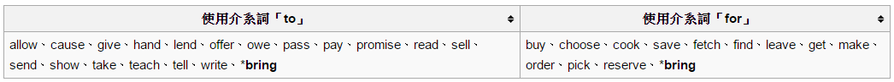

動詞分
### 1. Be動詞  
表達習慣、一件事情、事實或是不變的真理  
Be動詞的第一態是be、am、is和are，第二態是was和were，第三態則是been   
現在分詞和動名詞都是being，Be動詞的原形皆為「be」，am搭配主詞I，is搭配主詞he、she、it和單數名詞，are搭配you、  we、they和複數名詞。在進行式中，Be動詞才是真正的動詞，後面的Ving(動詞+ing)則看作現在分詞。Be動詞後面一般可以接  形容詞或名詞。接形容詞時，通常可對應為中文的表態句，如：「Melody was chubby before.」。而若後面接的是名詞或名  詞性單位的話，這通常可對應為中文的判斷句，這個名詞就是所謂的主詞補語，如：「I'm a wikipedia user.」  

### 2. Do  

### 3. 動詞/助動詞Have  

### 4. 助動詞  
助動詞是一種可以改變主要動詞意義或時態的一組動詞，在印歐語系語言中非常常見。助動詞出來主要是幫助主要動詞（Main   Verb）形成各種時態、語氣、語態、疑問句或否定句的動詞，所以才稱為『助』動詞。這些助動詞不能自己單獨使用，必須要和  另外一個沒有做過變化的動詞配合使用才有意義。如：「We don't play basketball.」(否定句)和「Did you enjoy your  first day back at school?」(疑問句)。    

### 5. 一般動詞  
除了Be動詞和助動詞之外的動詞統稱為一般動詞，代表一個動作。在一個句子裡，沒有出現時間副詞去看動詞是搭配用什麼時態的動詞也可以判斷出這個句子是什麼時候發生。如：「I went to the night market.」這一個句子的動詞是使用「go」的過去式----「went」，所以這一句是描述發生在過去的事情。一般動詞同樣有時態之分，在現在式中，主詞是第三人稱單數後面搭配的動詞須+s/+es/-y+ies，過去分詞(pp)與過去式(pt)規則的須+ed/+d。一般動詞裡面又分為許多不同類動詞，分法不同所有的性質也就不同，諸如下文所示。

### 6. 及物動詞與不及物動詞  

一般而言，一般動詞分成及物動詞和不及物動詞等兩大類，可以用可不可直接接上受詞來區分。 及物動詞(bought)至少需要一個受詞(cookies)以使句意完整，如：「Mary bought some cookies.」（瑪莉買了些餅乾），其bought是動詞，而cookies則是受詞，由此可判斷bought為一及物動詞。 而不及物動詞後面不需接任何受詞即可表達完整的句意，如：「He slept a lot during summer vacation.」，其中He是主詞，slept是動詞。但若不及物動詞後面要接受詞的話，必須選擇對應的動詞片語。即於動詞後先加上介詞才能再加受詞，如：「Johnson listens to the music before bed every day.」，因為listen為一不及物動詞，所以要接受詞必須先加介詞「to」。

### 7. 授與動詞  
I gave **him** some apples.」(我給他一些蘋果)  
有一些及物動詞(gave)要求兩個受詞(一般為直接受詞apples和間接受詞him)，直接被做出動作的就叫直接受詞（中文稱賓格），在做完第一個動作後才被做者，就是間接受詞（與格）。  
  
I gave **some apples** to him.  
若動詞後直接接直接受詞，則在接間接受詞前必須先加介系詞  

例如：「I gave him some apples.」(我給他一些蘋果)，相當於「I gave some apples to him.」其中I是主詞，  gave(give的過去式)是動詞，其中apple為直接受詞，him為間接受詞。上述的兩個句子，組成份子看來完全相同，但是直接受  詞與間接受詞出現在動詞後的先後順序，其實可反應說話者想強調的部分，例如：在「I gave some apples to him.」此句  中，說話者可能較想強調"apple"。若在I gave him some apples.此句中，則可能較想強調"him"。  

https://zh.wikipedia.org/wiki/%E8%8B%B1%E8%AA%9E%E5%8B%95%E8%A9%9E#Be.E5.8B.95.E8.A9.9E  

### 8. 使役動詞  
使役動詞是個特別的動詞類型，它後面可以直接接一個原形動詞。英文中的使役動詞共有四個：let、make、have。  

### 9. 情緒動詞  
情緒動詞可以衍生出所謂的情緒形容詞，兩種句法可以交互使用。情緒形容詞可以分為兩種，過去分詞(+ed)通常用來修飾人，解釋為「(某人)對(某物/人)…」後面要加特定的介詞；現在分詞(+ing)則通常修飾事物，解釋為「(某物/人)…很」後面接to。例如：「Wikipedia interests me.」=「I'm interested in Wikipedia.」=「Wikipedia is interesting to me.」。  

### 10. 感官動詞  
感官動詞（知覺動詞）可以表示身體五官的感受或動作，後面可接名詞、動名詞或不定詞，如：「I notice the cat slinking in our classroom.」。

### 11. 連綴動詞  

聽起來...sound  
嚐起來...taste  
聞起來...smell  
感覺....feel  
看起來...look  
句型: 主詞 + 連綴動詞 + 形容詞 / 主詞 + 連綴動詞 + like + 名詞。 連綴動詞的用法：連接形容詞點綴(修飾)主詞。 連綴動詞後面必須加上原形動詞。  

### 動詞單複數  

第三人稱單數的意思就像你認為的Alan和Mary。泛指不是第一人稱(I)、第二人稱(You)和複數(We, You, They,or Alan and Mary)之外，就可以以第三人稱的用法處理。  
舉理說明：   
1. I like English.(第一人稱用一般動詞，也就是複數的時候用的動詞)   
2. He likes English.(第三人稱用單數動詞)   
3. We like English.(複數用的動詞就是一般動詞)   
4. He and she like English.(兩人以上就用複數的動詞)   

第三人稱單數 有 he, she, it. 這三個字都是單數     
