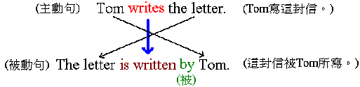

主　詞  be  過去分詞 (p.p.)  by  行　為　者  

Per talked with Peilun, Hwachi, this SKU’s test should be postponement, and please add Peilun as sub owner.  

=>
Per talked with Peilun `and` Hwachi, this SKU’s test should be `postponed`, and please add Peilun as sub owner.  

兩個中間用and 超過三個才用A, B and C  
當後面不是句子時不可以用, and 要直接用and連  

句子, and 句子  
句子 and 補充說明  

10. The boy opens the windows every morning.（主動句）    
　　 → The windows are opened by the boy every morning.（被動句）（注意看「沒有移動的」有哪些字？）    

11. Our Chinese teacher grew the tree when I studied here. （主動句）      
　　 → The tree was grown by our Chinese teacher when I studied here.（被動句）（注意看「沒有移動的」有哪些字？）    

12. My father washes the car every Sunday. （主動句）    
　　 → The car is washed by my father every Sunday.（被動句）（注意看「沒有移動的」有哪些字？）

===============================

時態:    
(現在單純式)13.The work	is finished by me.  
(過去單純式)14.The work	was finished by me yesterday.  
(未來單純式)15.The work	will be finished by me tomorrow.  
(現在完成式)16.The work	has been finished by me.    
