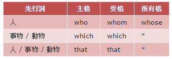

關係代名詞兼代名詞與連接詞，有who, whom, whose, which, that。  
代替先前出現的先行詞(名詞、代名詞或名詞片語)，另一方面它用來引導關係子句，來修飾所替代的先行詞,形成複句。  

關係代名詞	+	助動詞 be	+	現在分詞
                                                過去分詞

who 來代替『人』  
which 來代替『事物』或『動物』  
that 有時候可以取代 who 或 which   

The girl who called you is my friend.  
The girl whom you called is my friend.  

  

需要人的人擁有最長的生命。  
People who  **need** people have the longest lives.  

關係子句"who need people"修飾先行詞 people，people 複數，故用複數動詞 need。  
主要子句 "People ... have the longest lives."也是  

Our ability to use language is one of the things that **set** us apart from animals.  
先行詞 things 是複數，因此用複數動詞 set。  

The boy (who is) sitting over there is my son.  

http://www.taiwantestcentral.com/Grammar/Title.aspx?ID=248  
