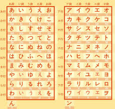
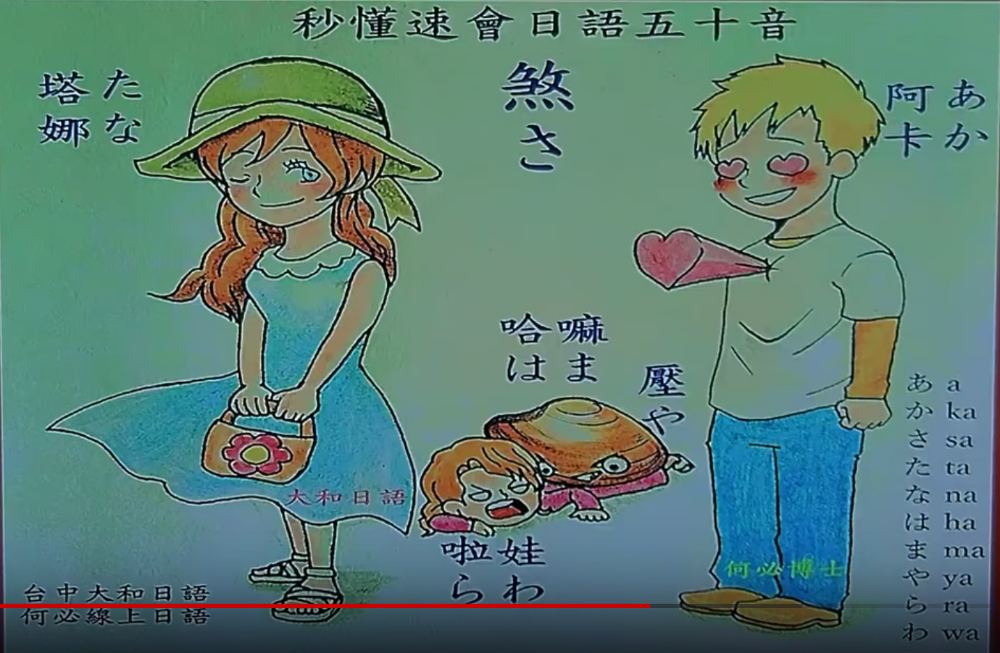

清音，50音，只有45個音  
母音：あ　い　う　え　お　  
其他都是無聲子音加母音  

平片假對照  
 

打字對照  
 

背法  
 
阿卡煞塔娜  
蛤蟆壓拉娃  

注意事項  
u段音除了ふ跟唱演歌不嘟嘴  
ra段音其實念la  

參考資料  
https://www.youtube.com/watch?v=uKL_Ki5IbjI  
https://www.youtube.com/channel/UCZ5Wn4ss81cVKSk74Duv2BA  

