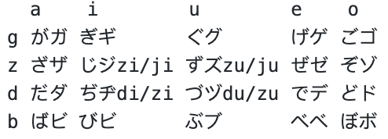
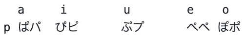

濁音發音混濁，清音右上角加冒號  

    
     

  a    i        u        e    o  
g がガ ぎギ      ぐグ      げゲ ごゴ    
z ざザ じジzi/ji ずズzu/ju ぜゼ ぞゾ  
d だダ ぢヂdi/zi づヅdu/zu でデ どド  
b ばビ びビ      ぶブ      べベ ぼボ  

相同發音:   
じ=ぢ  
ず=づ  

半濁音加圈 

    
     

  a     i        u        e    o
p ぱパ  ぴピ      ぷプ      ぺペ ぽポ  
