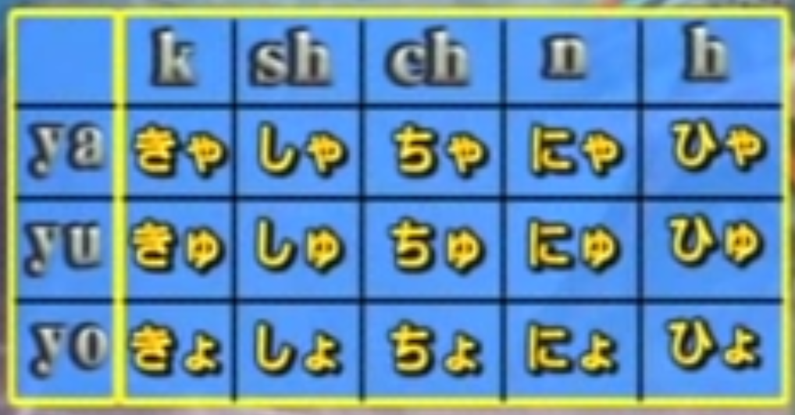
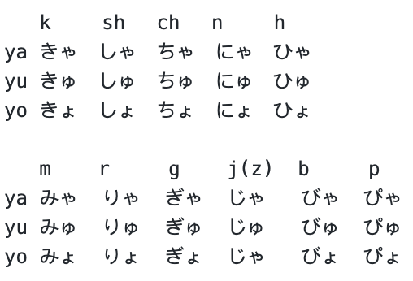

いイ段音加 やヤ　ゆユ　よヨ  
  

    
     

   k 　　sh 　ch 　n 　　h    
ya きゃ　しゃ　ちゃ　にゃ　ひゃ  
yu きゅ　しゅ　ちゅ　にゅ　ひゅ  
yo きょ　しょ　ちょ　にょ　ひょ  

   m    r     g    j(z)  b     p  
ya みゃ  りゃ  ぎゃ  じゃ   びゃ  ぴゃ  
yu みゅ  りゅ  ぎゅ  じゅ   びゅ  ぴゅ  
yo みょ  りょ  ぎょ  じゃ   びょ  ぴょ  

※ [ぢゃ、ぢゅ、ぢょ（ヂャ、ヂュ、ヂョ)]現已不使用，但在車站名或古蹟上仍可見到此舊文字  
※ しゃsha / しゅshu / しょsho 也可以寫作 しゃsya / しゅsyu / しょsyo  
※ ちゃcha / ちゅchu / ちょcho 也可以寫作 ちゃcya / ちゅcyu / cちょcyo 或是 ちゃtya / ちゅtyu / ちょtyo  

參考資料  
https://www.sigure.tw/learn-japanese/intro/japanese-50/319-dakuon-youon-chouon-sokuon  
