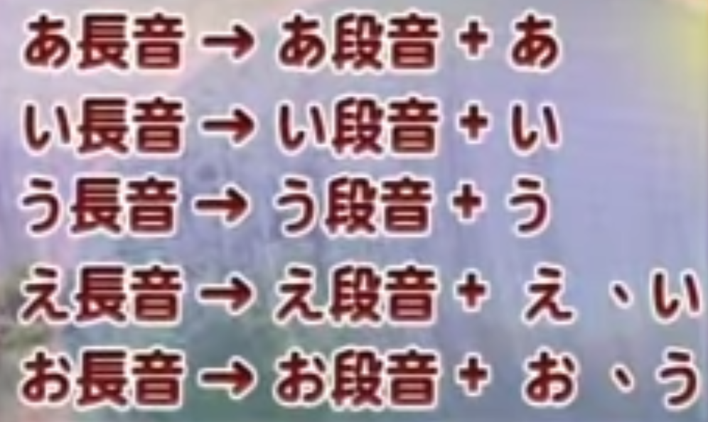

特殊音有三種：  
促音(つまる音),長音,鼻音  

# 促音  
寫在右下小字，念的時候停一拍，不發音小っ  
小っ就是重複促音後面那個音的子音，或是tsu前面加打 X 或 L   
(つ)小tu就打xtu  
(い)小i就打xi  

出現在　か　さ　た　ぱ　前面  
打字重疊前一個音節子音  
💢 如果是接て（te）則重複前面的羅馬拼音 t，標示為 tte  
💢 如果是接こ（ko）則重覆前面的羅馬拼音 k , 標是為 kko  

# 長音  
音節長短意思不同  
用鍵盤上 注音 ㄦ的那個符號  
片假名長音橫寫寫作 ㄧ  直寫寫作 ｜  
おじさん   叔叔 伯伯  
おじいさん 爺爺  

## 長音發音規則  
 

母親おかあさん ka跟a是長音  

## 幾種長音組合  
e結尾音+え/い 
o結尾音+お/う

# 鼻音  
n  
たいわんじん台灣人 

# 漢字  
直接打完一個詞再按空白鍵，就會自動轉換成漢字  

《輸入小撇步〜ん / ﾝ 》  
用鍵盤上 英文n 的符號，連按兩次  
《輸入小撇步〜ファ 》  
輸入FA即可，如果輸入FUA會變成フア  
《輸入小撇步〜 ・ 》
輸入鍵盤/  

# 參考資料  
https://www.sigure.tw/learn-japanese/intro/japanese-50/319-dakuon-youon-chouon-sokuon  
http://maiyatoma.pixnet.net/blog/post/34544161-[蒐集]-日文輸入法小撇步  
