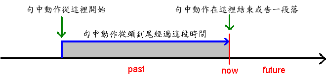

(1)已經被xxx處理過，(2)但目前仍未被解決。  
This issue had handled by Yanting and reported to Google, but INO found it still hasn't solved in N.  

(1)過去式，與現在狀態無關，用 had+ .ed    
(2)現在完成式   

===========================================================================================  
完成式的主要功能有兩個，都是用來和過去式做區隔，劃分出比較清楚的時間。  

- 第一種，在過去的某個時間點，強調動作的完成。  
I did the dishes (yesterday). ←我（昨天）洗碗了  
I've done the dishes. ← 我洗完碗了  

最大的差異就是，過去式可以加上時間，卻沒有說得很清楚事情是否有完成，但是完成式則很清楚地說明「做完了」。  
也就是說，當一個人同樣在述說過去某事件時，他可以根據話語中的重點是「事件確實完成」還是「事件的時間」，來決定自己要使用哪一種時態，重點在於時間的時候，優先使用過去式，不強調時間的時候，就用完成式，讓焦點回到事件本身。  

- 第二種，一樣是要補完過去簡單式在文意上可能的盲點。若發生在過去，而一直延續到現在，就要用完成式，句子後面常有”since”或”for”。  
I lived in Taiepi for three years. ←我現在並不住在台北。  
I've lived in Taipei for three years.←現在我仍然住在台北。  

  我們可以注意到，因為過去式往往暗示著現在和過去狀態不同，所以有一些意思不能夠用過去式來說，比如說，  
I've lived in Taipei for three years. 代表我三年前搬到台北住到現在，  
而 I lived in Taipei for three years. 卻可能是我小時候住在台北三年。  

- 第三種，表達一種經驗，「曾經/不曾」
I have been to America. 過去曾去過美國，將來也可能還會再去的意思。  

- 第四種，表示一件過去常發生的事。  
We have already had two typhoons so far this year. 發生了2次，還有機會再發生。 

「現在完成式」就是指某一個動作從過去的某一個時間點開始，一直持續到現在的時間  

- 1. 某一個動作從過去的某一個時間點開始，一直持續到現在的時間剛好完成。  

　例：3. 他們已經把功課做完了。  
　　　　They have finished their homework.  

- 2. 指從過去到現在的經驗。  

　例：8. 你曾經看過那個女孩子嗎？  
　　　　Have you ever seen that girl?  

- 3. 指某個動作從過去到現在，已經累積多少的次數或時間。這個表示句中動作，在往後的時間裡，有可能還會繼續下去。  

　例：9. Mary 已經看了三個鐘頭的電視了。  
　　　　Mary has watched TV for three hours.  

　　　10. Brown 先生已經寫了二本書了。  
　　　　Mr. Brown has written two books.    

=======================================================================================   
「for + 時間」（持續了一段時間）一定要使用「現在完成式」嗎？當然不是，看看底下三個例子：

- 9. Mary 已經看了三個鐘頭的電視了。  
　Mary `has` watched TV for three hours.  

- 11. Mary 昨天看了三個鐘頭的電視了。  
　Mary watched TV for three hours yesterday.  

- 12. Mary 到四點的時候，就看了三個鐘頭的電視。  
　Mary will have watched TV for three hours at four o'clock.  

這三個例子，顯然例句 9 是用「現在完成式」，但例句 11 是發生在過去，故仍是用「過去式」，而例句 12 呢？句中所指的「到四點的時候」還沒到，故應是用「未來」的表達方式才對。由此可知，「for + 時間」雖是「持續了一段時間」，但應用何種動詞時態，仍須看句中上下文來決定。  

========================================================================================   

相關副詞如 already, never, ever 等須放哪兒？以上這些字，都是放在 have/has 和「過去分詞」之間。如：  

- 13. He has already finished his housework.  
- 14. I've never been to the U.S.  
- 15. Have you ever read the book?（read 的過去分詞仍是 read，但讀成 [ rεd ]）  

===========================================================================================  
註：    
a. 其實「現在完成式」即已含有「已經」的意思，故例句 13 中的 already 的有無，根本不影響句子的意思。    
b. already 也可以放在句尾。    

19. He has gone to Taipei.（他已經去台北了。）  
　　── 表示他人現在不在這裡，而是在台北。  

20. He has been to Taipei.（他已經去過台北了。）  
　　── 這句話是說他有去台北的經驗。  
 ===========================================================================================  
過去完成式  
http://www.taiwantestcentral.com/Grammar/Title.aspx?ID=50  
